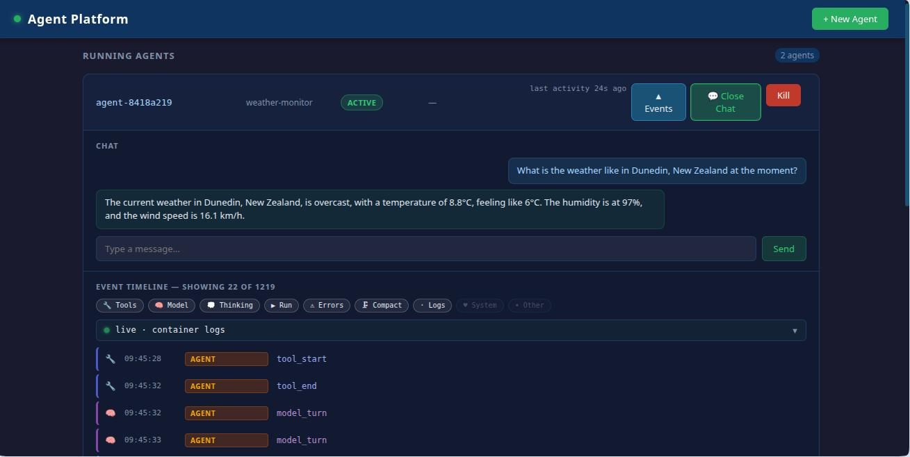

# Spawnly

A proof-of-concept platform for running AI agents on Kubernetes with cryptographic identity, fine-grained authorisation, and full lifecycle observability. Agents may be **short-lived** (do one job and exit) or **long-lived** (serve until deleted — including chat). This project is aimed at those who are interested in running agents within an enterprize environment, or who just want to run agents in isolated container based environments on their own machines.

Each agent pod gets a unique SPIFFE identity (JWT-SVID) issued by SPIRE at start. A per-pod **sidecar** uses that identity to register the agent with the **agent registry** and to obtain scoped OAuth 2.0 access tokens; the agent then calls protected APIs and emits structured lifecycle events throughout — all visible in a real-time web dashboard.

Two agent flavours run on the same platform contract:

- **A Go worker** (`agents/go-worker/`) — the minimal short-lived reference workload, built on the Go SDK (`github.com/spawnly/sdk-go`).
- **TypeScript / [Flue](https://www.npmjs.com/package/@flue/runtime) agents** (`agents/`) — built on the `@spawnly/sdk` (which lives in `sdks/typescript/`). These can chat over an LLM (OpenAI or Anthropic), call tools, and orchestrate child agents over A2A.

---

## Components at a glance

Spawnly is a handful of small, single-purpose services. Before the architecture diagram, here is what each one does — in a sentence.

**Control plane — spawning & lifecycle**

- **Orchestrator** — the front door. A REST API that accepts spawn requests, lists agents, and forwards chat messages. It turns a spawn request into an `AgentWorkload` record in Kubernetes.
- **Operator** — a Kubernetes controller that watches those records and creates (and tears down) each agent's Pod, plus a Service if the agent is long-lived.

**Identity & authorisation**

- **SPIRE** — issues every agent pod a unique cryptographic identity (a JWT-SVID) at startup — no shared secrets or static keys.
- **agent-sidecar** — a helper container in every agent pod. It exchanges the pod's SVID for scoped OAuth access tokens and hands them to the agent on request, so agent code carries no identity plumbing.
- **IdentityServer** — the OAuth 2.0 authority that mints those access tokens, trusting the SVID as proof of who the agent is — but only after checking the agent registry that the agent exists and is active.
- **SpiceDB** — the authorisation database. Relationship-based ("this agent may act for this tenant"); protected services check it before serving a request.

**Agents & the services they call**

- **Agents** — the actual workloads: a minimal Go worker, plus TypeScript/Flue agents that chat over an LLM, call tools, and can spawn child agents.
- **Sample API** — a protected example service that agents call, to demonstrate token-based access and tenant/authorisation checks.

**Observability**

- **Agent Registry** — the system's memory. The sidecar registers each agent here, every component records lifecycle events here, agent templates live here, and IdentityServer consults it to check an agent is active before issuing a token.
- **Dashboard UI** — the real-time web view: spawn agents, watch their event timelines, and chat with long-lived ones ([screenshot](spawnly-ui.jpg)).

For the directory-level breakdown (paths, languages, internal packages), see [Repository layout](#repository-layout).

---

## Architecture

The diagram shows the full flow for a single agent — spawn request → CRD → pod, the sidecar-owned identity/token exchange, agent work, and the chat path.


**The key thing the sidecar does:** the agent container never performs the SVID/registration/token dance itself. The `agent-sidecar` fetches the JWT-SVID from SPIRE, **self-registers the agent** with the agent registry (SVID as Bearer), exchanges the SVID at IdentityServer for a scoped access token, and exposes a local `/token` endpoint (`:8089`). The agent asks the sidecar for tokens via the SDK's `TokenClient`. This keeps agent code framework- and language-agnostic.

IdentityServer doesn't mint a token blindly: during the grant it **looks up the agent registry to confirm the agent exists and is `active`** (`AgentRegistryValidator`), so a deregistered or unknown agent can't obtain credentials.

### Lifecycle events

As an agent moves through its life — spawned, given an identity, doing work, exiting — each component records what happened as a structured **event**: a timestamped record with a `source` (which component emitted it), a `type` (what happened), and a JSON `payload` (the details). Every event is POSTed to the registry, which keeps them per-agent in an append-only store. The dashboard polls that store and renders each agent's events as a live timeline — so the whole system is observable without attaching a debugger or grepping pod logs. Events fall into two groups.

**Platform events** (emitted by the orchestrator, operator, and registry):

| Source        | Event                       | What happens                                                          |
|---------------|-----------------------------|----------------------------------------------------------------------|
| Orchestrator  | `workload_created`          | `POST /spawn` accepted; `AgentWorkload` CRD written to Kubernetes     |
| Orchestrator  | `workload_spawning`         | Spawn request validated and dispatched                               |
| Operator      | `pod_created`               | Operator reconciles the CRD, fetches the template, creates the Pod   |
| Registry      | `registry_record_created`   | Sidecar self-registers the agent via `POST /v1/agents` (SVID as Bearer token) |
| Registry      | `spicedb_relations_written` | Registry writes the agent's SpiceDB relations (omitted if global)    |

**Agent activity events** (the neutral, framework-agnostic vocabulary forwarded by the SDK's `instrumentFlue`, plus sidecar/agent startup):

`svid_fetched` · `started` · `run_start` / `run_end` · `model_turn` · `tool_start` / `tool_end` · `thinking` · `compaction` · `heartbeat` · `log` · `error`

The dashboard's event panel has **per-agent category filters** — click the chips to show/hide Tools, Model, Thinking, Run, Errors, Logs, System, etc. `heartbeat` (the long-lived liveness signal) is classified as **System** and hidden by default so it doesn't clog the timeline.



---

## Repository layout

Every directory, by language and purpose:

| Path | Language | Description |
|------|----------|-------------|
| `cmd/orchestrator/` | Go | REST API. Accepts `POST /spawn`, creates `AgentWorkload` CRDs, proxies agent/event queries and chat messages to agents/registry |
| `cmd/operator/` | Go | Kubernetes controller (controller-runtime). Watches `AgentWorkload` CRDs and manages the agent Pod (and Service, for long-lived agents) lifecycle |
| `cmd/registry/` | Go | In-memory agent and template store. Accepts self-registration, persists lifecycle events, writes SpiceDB relationships |
| `cmd/agent-sidecar/` | Go | Per-pod native sidecar (`:8089`). Fetches the JWT-SVID, exchanges it for scoped OAuth tokens, and serves `/token` to the agent |
| `cmd/sample-api/` | Go | Protected HTTP API (`GET /work`, `POST /task`). Validates OAuth 2.0 Bearer tokens and a SpiceDB `work_on` check. Deployed as `sample-api`, `sample-api-a`, `sample-api-b`, and `sample-api-global` (the last with `REQUIRE_TENANT=false`) |
| `cmd/dashboard/` | Go + HTML | Web UI. Polls agents and events, chats with long-lived agents, filters events per-agent; proxies all requests to the orchestrator |
| `agents/` | TypeScript + Go | Agent workloads. TypeScript/Flue agents on the `@spawnly/sdk`: `weather-monitor` (chat + tool calls), `currency-converter`, `trip-planner`, `parent-agent`, `child-agent`, `global-worker`; plus the Go `go-worker` (minimal short-lived reference workload, on `github.com/spawnly/sdk-go`) |
| `sdks/typescript/` | TypeScript | The `@spawnly/sdk` package — token/HTTP/event helpers consumed by the Flue agents |
| `sdks/go/` | Go | The `github.com/spawnly/sdk-go` module — the same token/HTTP/event helpers for Go agents like `go-worker` |
| `identityserver/` | C# (.NET) | Duende IdentityServer. Issues OAuth 2.0 access tokens; authenticates the sidecar via JWT-SVID `client_assertion` |
| `internal/events/` | Go | Shared lifecycle event types and HTTP client used by all Go services |
| `internal/operator/` | Go | Reconciler logic (separated from `cmd/operator/` for testability) |
| `internal/registry/` | Go | Registry client interface and mock (used by operator and orchestrator) |
| `internal/spicedb/` | Go | SpiceDB gRPC client wrapper (schema write, relationship write, permission check) |
| `internal/spiffe/` | Go | SPIFFE JWT-SVID fetch and validation helpers |
| `internal/tokenvalidator/` | Go | OAuth 2.0 JWT access-token validator (used by the sample API) |
| `api/v1alpha1/` | Go | `AgentWorkload` CRD Go types and scheme registration |
| `deploy/crds/` | YAML | `AgentWorkload` CustomResourceDefinition manifest |
| `deploy/manifests/` | YAML | Kubernetes Deployment/Service manifests for every component |
| `deploy/secrets/` | YAML | `ai-provider` Secret (`provider`, `api-key`, `model`) consumed by Flue agents |
| `deploy/spire/` | YAML | SPIRE Helm values and `ClusterSPIFFEID` for automatic agent identity assignment |
| `deploy/kind/` | YAML | Kind cluster config (single control-plane + worker node) |
| `scripts/` | Bash | `bootstrap.sh` (one-shot cluster setup), `seed.sh` (template seeding), `demo.sh` (interactive demo) |
| `website/` | Astro / Starlight | The authoring docs site (renders `docs/`) |

---

## Prerequisites

- [Docker](https://docs.docker.com/get-docker/) (with docker-outside-docker or Docker Desktop)
- [kind](https://kind.sigs.k8s.io/docs/user/quick-start/#installation)
- [kubectl](https://kubernetes.io/docs/tasks/tools/)
- [Helm](https://helm.sh/docs/intro/install/)
- [jq](https://stedolan.github.io/jq/)
- Go 1.25+ (for local builds and tests)
- Node.js 20+ and npm (for the TypeScript agents and the docs site)
- .NET 8 SDK (for IdentityServer local builds only; not required for Docker/Kind)

> If you are using the included devcontainer, all of these are pre-installed.

`make bootstrap` runs both inside the devcontainer and natively on a macOS/Linux host — it
auto-detects which (via `/.dockerenv`) and only does the devcontainer-specific Kind network wiring
when needed. For a native run, install the tools above on your PATH first (on macOS:
`brew install kind kubectl helm jq` plus Docker Desktop). If detection ever guesses wrong, force it
with `BOOTSTRAP_IN_CONTAINER=1` (container) or `BOOTSTRAP_IN_CONTAINER=0` (host).

To use the LLM-backed agents, copy `.env.example` to `.env` and set `AI_PROVIDER` (`openai` or `anthropic`) and `AI_API_KEY`. `make bootstrap` loads these into the `ai-provider` Secret.

---

## Setup

### 1. Build images and create a Kind cluster

```bash
make bootstrap
```

This single command:
1. Creates a Kind cluster named `agent-platform`
2. Builds all Docker images (Go services, the TypeScript agents, and the .NET IdentityServer)
3. Loads images into Kind nodes
4. Installs SPIRE via Helm and applies the `ClusterSPIFFEID`
5. Applies the `AgentWorkload` CRD, the `ai-provider` Secret, and all Kubernetes manifests
6. Seeds **all** agent templates into the registry (via `scripts/seed.sh`, which discovers every co-located `template.json`)

### 2. Run the interactive demo

```bash
make demo
```

This will:
- Kill any stale port-forwards
- Port-forward the orchestrator to `localhost:8080` and the dashboard to `localhost:8090`
- Spawn a demo agent with task `"hello from the demo"`
- Tail its phase until `Completed` or `Failed`
- Print the lifecycle event timeline

Open `http://localhost:8090` to watch events, spin up agents, and chat with long-lived ones in real time — as in the [dashboard screenshot](#lifecycle-events) above.

---

## AI provider & chat

Flue agents read their LLM config from the `ai-provider` Secret, injected by the operator as `AI_PROVIDER` / `AI_API_KEY` / `AI_MODEL`. Both OpenAI (`openai/gpt-4o`, …) and Anthropic (`anthropic/claude-sonnet-4-6`, …) are supported.

**Long-lived agents that declare `supportsChat: true` can be chatted with from the dashboard** (the 💬 Chat button). A message round-trips:

```
Dashboard → POST /api/agents/{id}/message → Orchestrator → POST http://{id}-svc:8080/agents/chat/{sessionId} → agent
```

The agent replies with `{ "response": "..." }`. The `weather-monitor` agent, for example, holds a per-session conversation and calls a `get_weather` tool. The equivalent from the CLI:

```bash
curl -X POST http://localhost:8080/v1/agents/<workloadName>/message \
  -H 'Content-Type: application/json' \
  -d '{"message":"What is the weather in Tokyo?","sessionId":"<workloadName>"}'
```

---

## Tenancy

Agents may be **tenanted** or **global (tenant-less)**, decided by presence of a tenant id rather than a separate mode:

- A template's `requiresTenant` field gates spawning. The orchestrator rejects a tenant-less `POST /spawn` for a template with `requiresTenant: true`.
- A global agent (no `tenantId`) gets a SPIFFE id without the tenant segment and an empty SpiceDB relation set; `tenantHeader()` in the SDK omits the `X-Tenant-ID` header.
- The sample API's `REQUIRE_TENANT` env var (default `true`) controls whether it enforces a tenant header. `sample-api-global` runs with `REQUIRE_TENANT=false` so global agents can call it.

See [Defining a Template](docs/authoring/04-defining-a-template.md) for the full schema.

---

## Authoring agents

Guides for building a new agent from scratch live in [`docs/authoring/`](docs/authoring/).
These render as a searchable documentation website (Starlight) under
[`website/`](website/) — run `cd website && npm install && npm run dev`, or see
[website/README.md](website/README.md). Start with the shared contract, then
follow the scenario that matches your agent:

- [Anatomy of an Agent](docs/authoring/00-anatomy.md) — the platform contract, injected env, the SDK, and the build/register/spawn path.
- [Scenario 1 — Job-and-exit](docs/authoring/01-job-and-exit.md) (Price Reporter): spin up, do one job, exit.
- [Scenario 2 — Loop-until-stopped](docs/authoring/02-loop-until-stopped.md) (Queue Worker): long-lived, runs until deleted.
- [Scenario 3 — Parent → child](docs/authoring/03-parent-and-child.md) (Trip Planner & Currency Converter): orchestration over A2A with delegated, attenuated authority.
- [Defining a Template](docs/authoring/04-defining-a-template.md) — the full `AgentTemplate` schema field by field, who consumes each field, and the build/register lifecycle.
- [Defining Policy](docs/authoring/05-defining-policy.md) — an agent's own authority (`authzTemplate` + scopes) and parent→child delegation (`delegation` block), with a set-vs-consume component map.

---

## Running tests

```bash
make test
```

Runs all Go unit tests (`go test ./... -v -count=1`). Tests cover the operator reconciler, registry client, SpiceDB client, sample API handlers, and orchestrator HTTP handlers using mocks — no cluster required.

---

## Manual operations

### Spawn a tenanted agent

```bash
curl -X POST http://localhost:8080/spawn \
  -H 'Content-Type: application/json' \
  -d '{"userId":"user-1","tenantId":"tenant-1","agentType":"worker","task":"hello"}'
```

### Spawn a global (tenant-less) agent

```bash
curl -X POST http://localhost:8080/spawn \
  -H 'Content-Type: application/json' \
  -d '{"userId":"user-1","agentType":"weather-monitor"}'
```

### Chat with a long-lived agent

```bash
curl -X POST http://localhost:8080/v1/agents/<workloadName>/message \
  -H 'Content-Type: application/json' \
  -d '{"message":"hello","sessionId":"<workloadName>"}'
```

### List agents

```bash
curl http://localhost:8080/v1/agents | jq
```

### Inspect lifecycle events for an agent

```bash
curl http://localhost:8080/v1/agents/<workloadName>/events | jq
```

### Delete (kill) an agent

```bash
curl -X DELETE http://localhost:8080/v1/agents/<workloadName>
```

### View service logs

```bash
kubectl logs -l app=orchestrator --follow
kubectl logs -l app=registry --follow
kubectl logs -l app=identity-server --follow
kubectl logs -l app=sample-api --follow
# Agent pods are ephemeral — find them by name:
kubectl get pods
kubectl logs <workloadName>-pod -c agent          # the agent container
kubectl logs <workloadName>-pod -c agent-sidecar  # the identity/token sidecar
```

---

## Rebuilding after code changes

The Makefile provides targets for the common loops:

```bash
# Rebuild + roll a Go service Deployment (orchestrator, registry, dashboard, operator, sample-api):
make redeploy-dashboard

# Rebuild + load a TypeScript agent image into Kind (then spawn a fresh agent to pick it up):
make reload-weather-monitor

# Rebuild + load the per-pod sidecar (picked up by newly spawned agents):
make reload-sidecar

# Re-seed templates into the registry (its store is in-memory and resets on restart):
make reseed

# Tail a service's logs:
make logs-orchestrator

# Or rebuild and load everything:
make kind-load
```

---

## Key design decisions

- **SPIFFE/SPIRE for workload identity**: every agent pod gets a unique JWT-SVID (`spiffe://cluster.local/...`) via the CSI driver — no shared secrets or static API keys.
- **A per-pod sidecar owns registration and token exchange**: the `agent-sidecar` self-registers the agent with the agent registry and turns the SVID into scoped OAuth tokens served at `:8089`, so agent code stays free of identity plumbing and works the same in Go or TypeScript.
- **IdentityServer as the OAuth 2.0 authority**: the sidecar uses the SVID as a `client_assertion` (RFC 7523 JWT Bearer) to obtain a scoped access token, validated against SPIRE's JWKS endpoint — and IdentityServer additionally checks the agent registry that the agent is `active` before issuing.
- **SpiceDB for authorisation**: the registry writes the agent's relationships on registration (a `tenant:T#agent@agent:X` relation when tenanted, none when global). The sample API checks `work_on` permission before serving requests.
- **Tenancy from presence**: an agent is tenanted if a tenant id is present; the same code path serves global agents by simply omitting the tenant segment, header, and relations.
- **Append-only, filterable event log**: lifecycle events flow into the registry's in-memory store. The dashboard appends new events to the DOM without replacing existing rows (preserving expanded/collapsed state) and filters them per-agent by category (heartbeat hidden by default).
