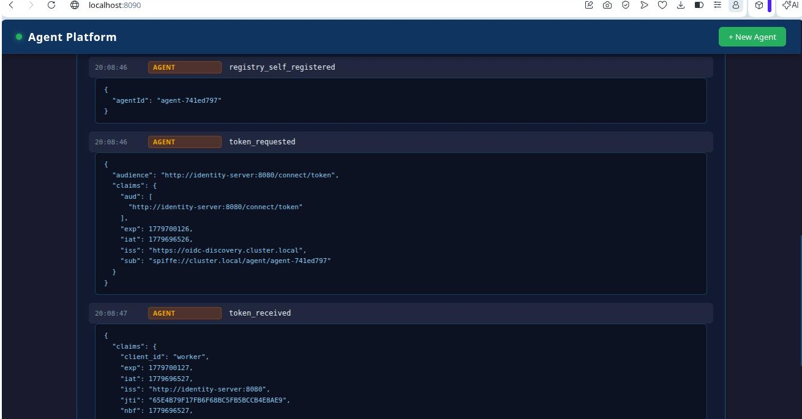

# Agent Platform POC

A proof-of-concept platform for running short-lived AI agents on Kubernetes with cryptographic identity, fine-grained authorisation, and full lifecycle observability.

Each agent gets a unique SPIFFE identity (JWT-SVID) issued by SPIRE at pod start. It uses that identity to self-register with the registry, exchange it for an OAuth 2.0 access token via IdentityServer, call a protected sample API, and emit structured lifecycle events throughout — all visible in a real-time web dashboard.

---

## Architecture

The diagram below shows the complete flow for a single agent, from spawn request through to completion.

```
  +----------------------------------------------------------------------------------------------------+
  |  Kubernetes (Kind)                                                                                 |
  |                                                                                                    |
  |  +----------+     +--------------+   (1) create   +------------------+                           |
  |  | Dashboard|---->| Orchestrator |--------------->| AgentWorkload    |                           |
  |  |  :8090   |     |    :8080     |                |    CRD           |                           |
  |  +----------+     +--------------+                +--------+---------+                           |
  |   browser SPA      spawn / list                            |                                     |
  |                                               (2) watched by Operator                            |
  |                                                            v                                     |
  |  +----------+     +--------------+                +--------+---------+                           |
  |  | SpiceDB  | <-- |   Registry   | <-GetTemplate- |    Operator     |                           |
  |  |  :50051  |     |    :8080     |                | (ctrl-runtime)  |                           |
  |  +----------+     +--------------+                +--------+---------+                           |
  |  write rels on     events /                               |                                      |
  |  self-register     templates                      (3) creates Pod                                |
  |                        ^                                   v                                     |
  |                        |             +---------------------+                                     |
  |                        |             |      Agent Pod      |                                     |
  |                        |             |    (short-lived)    |                                     |
  |                        |             |                     |                                     |
  |                        |             | (4) fetch JWT-SVID <+-- SPIRE CSI volume                 |
  |                        +-------------|    aud: registry    |                                     |
  |                                      | (5) self-register   |                                     |
  |                                      |                     |                                     |
  |                                      | (6) fetch JWT-SVID <+-- SPIRE CSI volume                 |
  |                                      |    aud: IS URL      |                                     |
  |                                      |                     |   +---------------------------+     |
  |                                      | (7) SVID assertion -+-->| IdentityServer :5001      |     |
  |                                      |                     |   | client_credentials grant  |     |
  |                                      |   <-- access_token <+---| issues JWT access_token   |     |
  |                                      |                     |   +---------------------------+     |
  |                                      |                     |   +---------------------------+     |
  |                                      | (8) Bearer token   -+-->| Sample API :8080          |     |
  |                                      |     POST /task      |   | validates JWT Bearer +    |     |
  |                                      |     <-- result     <+---| SpiceDB work_on check     |     |
  |                                      |                     |   +---------------------------+     |
  |                                      +---------------------+                                     |
  |                                                                                                    |
  |  +----------------------------------------------------------------------------------------------+ |
  |  | SPIRE (spire-system): Server + Agent DaemonSet + OIDC Discovery Provider                   | |
  |  | Issues JWT-SVIDs to pods automatically via CSI volume mount                                 | |
  |  +----------------------------------------------------------------------------------------------+ |
  +----------------------------------------------------------------------------------------------------+
```

### Agent lifecycle event sequence

| Step | Source        | Event                      | What happens                                                        |
|------|---------------|----------------------------|---------------------------------------------------------------------|
| (1)  | Orchestrator  | `workload_created`         | `POST /spawn` accepted; `AgentWorkload` CRD written to K8s          |
| (2)  | Operator      | `pod_created`              | Operator reconciles CRD, fetches template, creates agent Pod        |
| (3)  | Registry      | `registry_record_created`  | Agent self-registers via `POST /v1/agents` with SVID as Bearer token|
| (4)  | Registry      | `spicedb_relations_written`| Registry writes `tenant:T#agent@agent:X` relationship to SpiceDB   |
| (5)  | Agent         | `svid_acquired`            | Agent fetches JWT-SVID from SPIRE (audience: `registry`)            |
| (6)  | Agent         | `registry_self_registered` | Registration confirmed; agent receives its canonical `agentId`      |
| (7)  | Agent         | `token_requested`          | Agent fetches second SVID (audience: IdentityServer token URL)      |
| (8)  | Agent         | `token_received`           | `client_credentials` grant completes; OAuth 2.0 access token issued |
| (9)  | Agent         | `task_dispatched`          | Agent calls `POST /task` on Sample API with Bearer access token     |
| (10) | Agent         | `task_result`              | Sample API responds; result captured                                |
| (11) | Agent         | `agent_completed`          | Agent exits cleanly; operator marks CRD `Completed`                 |

---

## Components

| Path | Language | Description |
|------|----------|-------------|
| `cmd/orchestrator/` | Go | REST API. Accepts `POST /spawn`, creates `AgentWorkload` CRDs, proxies agent/event queries to the registry |
| `cmd/operator/` | Go | Kubernetes controller (controller-runtime). Watches `AgentWorkload` CRDs and manages the agent Pod lifecycle |
| `cmd/registry/` | Go | In-memory agent and template store. Accepts self-registration, persists lifecycle events, writes SpiceDB relationships |
| `cmd/agent/` | Go | Short-lived workload. Fetches SVIDs, self-registers, exchanges for an OAuth token, calls the sample API, emits events |
| `cmd/sample-api/` | Go | Protected HTTP API (`GET /work`, `POST /task`). Validates OAuth 2.0 Bearer tokens and SpiceDB `work_on` permission |
| `cmd/dashboard/` | Go + HTML | Web UI. Polls agent list and lifecycle events; proxies all requests to the orchestrator |
| `identityserver/` | C# (.NET) | Duende IdentityServer. Issues OAuth 2.0 access tokens; authenticates agents via JWT-SVID `client_assertion` |
| `internal/events/` | Go | Shared lifecycle event types and HTTP client used by all Go services |
| `internal/operator/` | Go | Reconciler logic (separated from `cmd/operator/` for testability) |
| `internal/registry/` | Go | Registry client interface and mock (used by operator and orchestrator) |
| `internal/spicedb/` | Go | SpiceDB gRPC client wrapper (schema write, relationship write, permission check) |
| `internal/spiffe/` | Go | SPIFFE JWT-SVID fetch and validation helpers |
| `internal/tokenvalidator/` | Go | OAuth 2.0 JWT access-token validator (used by sample API) |
| `api/v1alpha1/` | Go | `AgentWorkload` CRD Go types and scheme registration |
| `deploy/crds/` | YAML | `AgentWorkload` CustomResourceDefinition manifest |
| `deploy/manifests/` | YAML | Kubernetes Deployment/Service manifests for every component |
| `deploy/spire/` | YAML | SPIRE Helm values and `ClusterSPIFFEID` for automatic agent identity assignment |
| `deploy/kind/` | YAML | Kind cluster config (single control-plane + worker node) |
| `scripts/` | Bash | `bootstrap.sh` (one-shot cluster setup) and `demo.sh` (interactive demo) |

---

## Prerequisites

- [Docker](https://docs.docker.com/get-docker/) (with docker-outside-docker or Docker Desktop)
- [kind](https://kind.sigs.k8s.io/docs/user/quick-start/#installation)
- [kubectl](https://kubernetes.io/docs/tasks/tools/)
- [Helm](https://helm.sh/docs/intro/install/)
- [jq](https://stedolan.github.io/jq/)
- Go 1.22+ (for local builds and tests)
- .NET 8 SDK (for IdentityServer local builds only; not required for Docker/Kind)

> If you are using the included devcontainer, all of these are pre-installed.

---

## Setup

### 1. Build images and create a Kind cluster

```bash
make bootstrap
```

This single command:
1. Creates a Kind cluster named `agent-platform`
2. Builds all Docker images (Go services + .NET IdentityServer)
3. Loads images into Kind nodes
4. Installs SPIRE via Helm and applies the `ClusterSPIFFEID`
5. Applies the `AgentWorkload` CRD and all Kubernetes manifests
6. Seeds the `worker` agent template into the registry

### 2. Run the interactive demo

```bash
make demo
```

This will:
- Kill any stale port-forwards
- Port-forward the orchestrator to `localhost:8080` and the dashboard to `localhost:8090`
- Spawn a demo agent with task `"hello from the demo"`
- Tail its phase until `Completed` or `Failed`
- Print the lifecycle event timeline

Open `http://localhost:8090` to watch events and spin up agents in real time:


---

## Running tests

```bash
make test
```

Runs all Go unit tests (`go test ./... -v -count=1`). Tests cover the operator reconciler, registry client, SpiceDB client, and orchestrator HTTP handlers using mocks — no cluster required.

---

## Manual operations

### Spawn an agent

```bash
curl -X POST http://localhost:8080/spawn \
  -H 'Content-Type: application/json' \
  -d '{"userId":"user-1","tenantId":"tenant-1","agentType":"worker","task":"hello"}'
```

### List agents

```bash
curl http://localhost:8080/v1/agents | jq
```

### Inspect lifecycle events for an agent

```bash
curl http://localhost:8080/v1/agents/<workloadName>/events | jq
```

### Delete (kill) an agent

```bash
curl -X DELETE http://localhost:8080/v1/agents/<workloadName>
```

### View service logs

```bash
kubectl logs -l app=orchestrator --follow
kubectl logs -l app=registry --follow
kubectl logs -l app=identity-server --follow
kubectl logs -l app=sample-api --follow
# Agent pods are ephemeral — find them by name:
kubectl get pods
kubectl logs <workloadName>-pod
```

---

## Rebuilding after code changes

```bash
# Rebuild a single service image and reload into Kind:
docker build --target orchestrator -t agent-orchestrator:latest .
docker exec agent-platform-control-plane ctr -n k8s.io images rm docker.io/library/agent-orchestrator:latest 2>/dev/null || true
kind load docker-image agent-orchestrator:latest --name agent-platform
kubectl rollout restart deployment/orchestrator

# Or rebuild everything:
make kind-load
kubectl rollout restart deployment/orchestrator deployment/registry deployment/dashboard \
  deployment/agent-operator deployment/sample-api deployment/identity-server
```

---

## Key design decisions

- **SPIFFE/SPIRE for workload identity**: every agent pod gets a unique JWT-SVID (`spiffe://cluster.local/agent/<workload-name>`) via the CSI driver — no shared secrets or static API keys.
- **IdentityServer as the OAuth 2.0 authority**: agents use their SVID as a `client_assertion` (RFC 7523 JWT Bearer) to obtain a scoped access token. IdentityServer validates the assertion against SPIRE's JWKS endpoint.
- **SpiceDB for authorisation**: the registry writes a `tenant:T#agent@agent:X` relationship when an agent registers. The sample API checks `work_on` permission before serving requests.
- **Append-only event log**: lifecycle events flow from every component into the registry's in-memory event store. The dashboard polls this store and appends new events to the DOM without replacing existing elements, preserving the expanded/collapsed state of event details.
